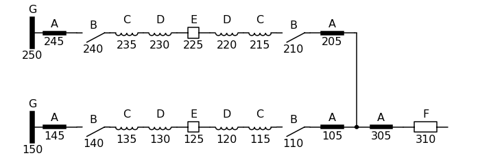

# Draw electrical onelines
This projects uses SchemDraw to draw station to station onelines.

For example a table with a sudo-topology like:

```csv
element,alpha,loc
bus,G,150
subcond,A,145
switch,B,140
CT,C,135
CT,D,130
breaker,E,125
CT,D,120
CT,C,115
switch,B,110
subcond,A,105
bus,G,250
subcond,A,245
switch,B,240
CT,C,235
CT,D,230
breaker,E,225
CT,D,220
CT,C,215
switch,B,210
subcond,A,205
subcond,A,305
wavetrap,F,310
```

Could produce an image like:


